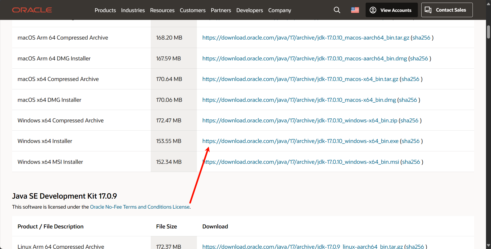
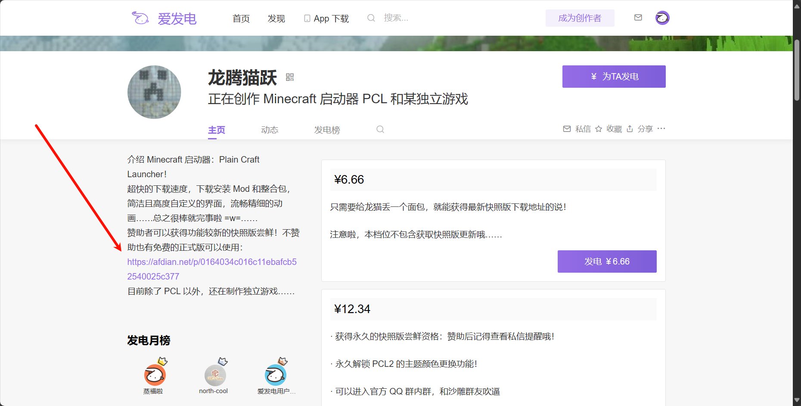
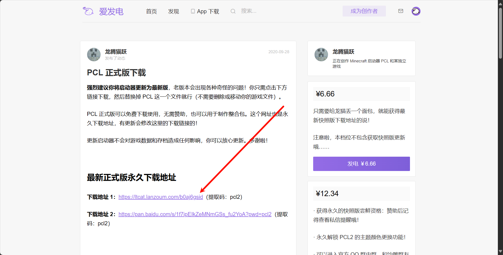
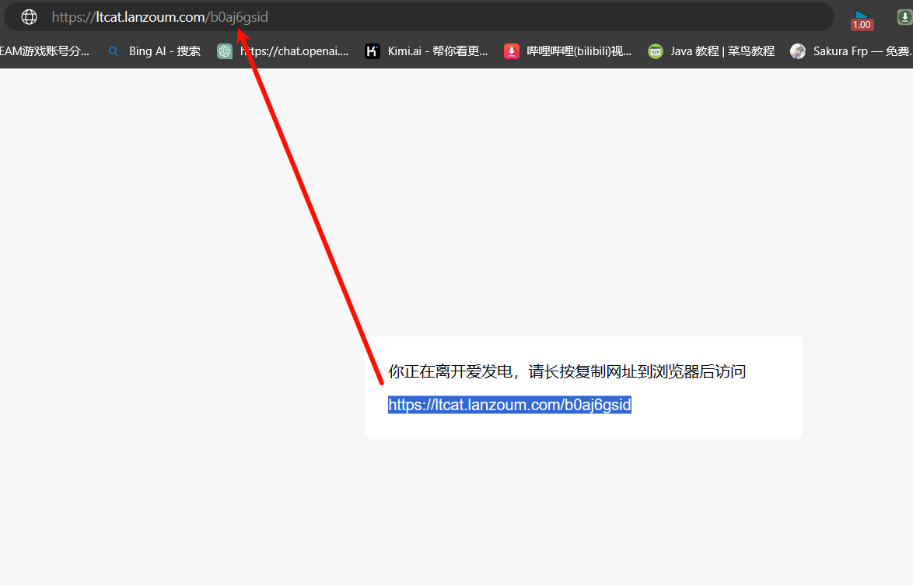
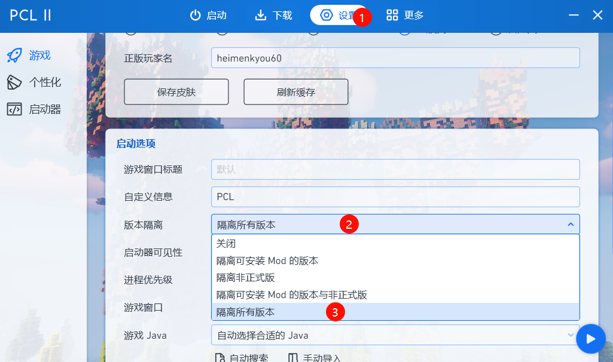
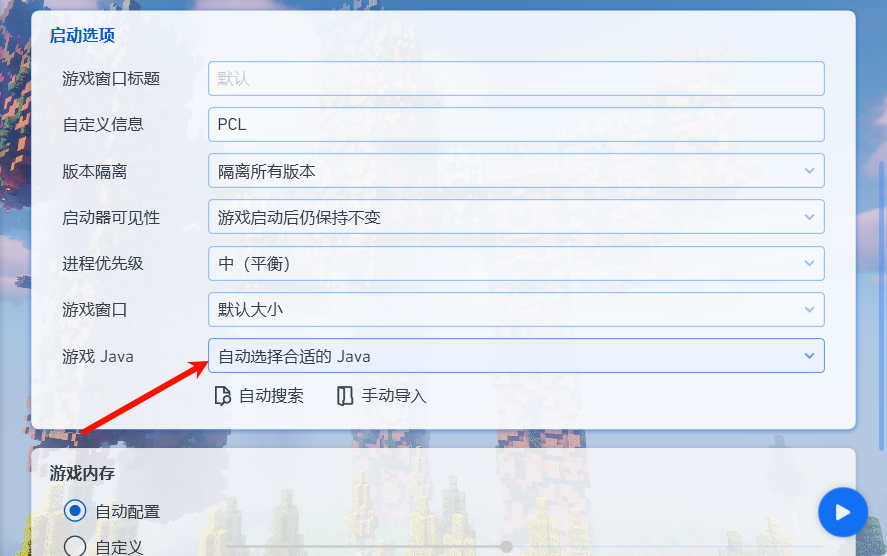
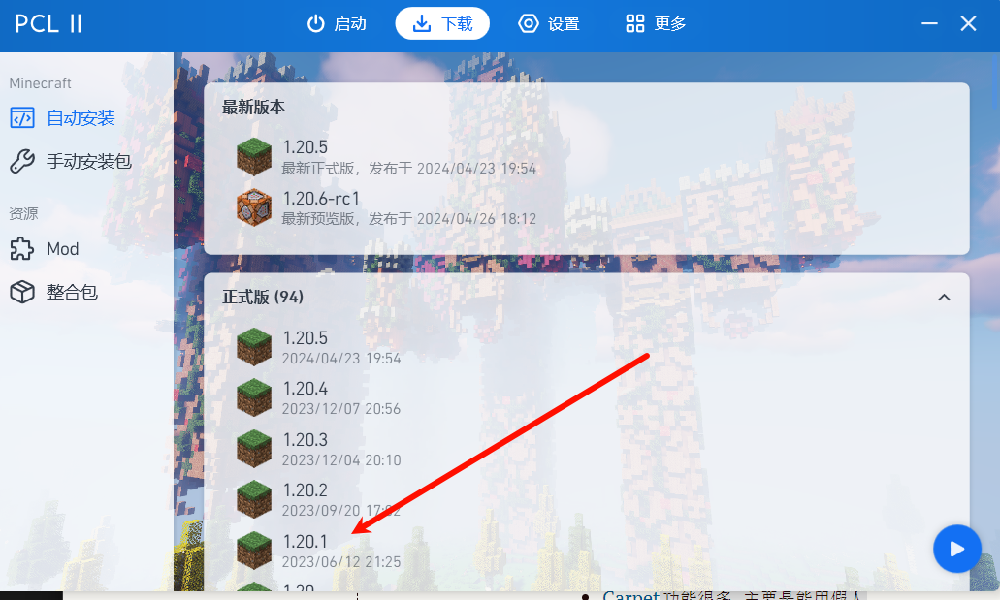
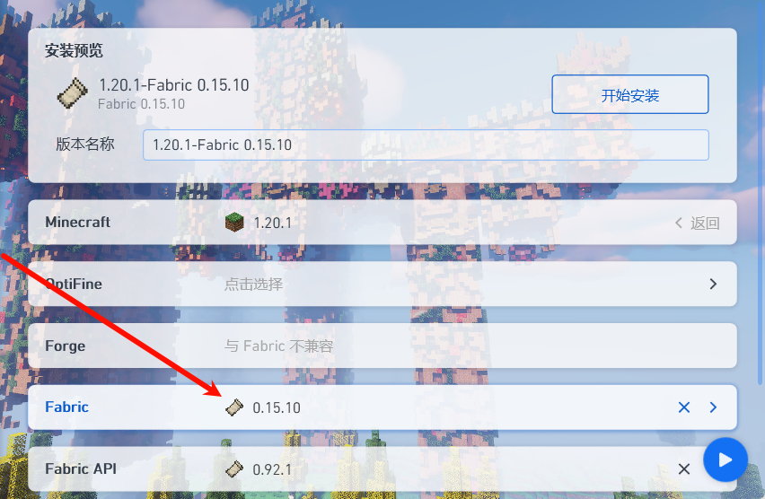
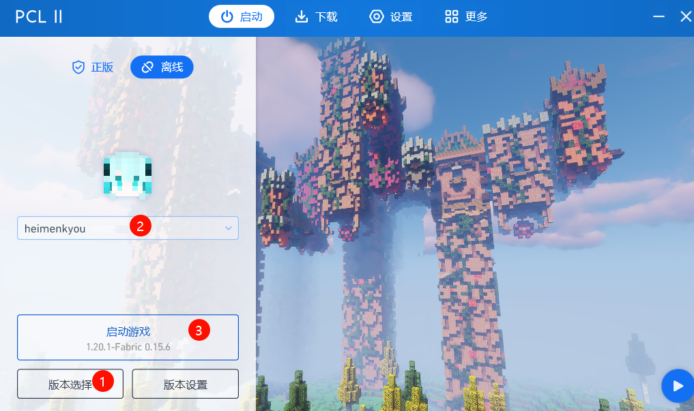
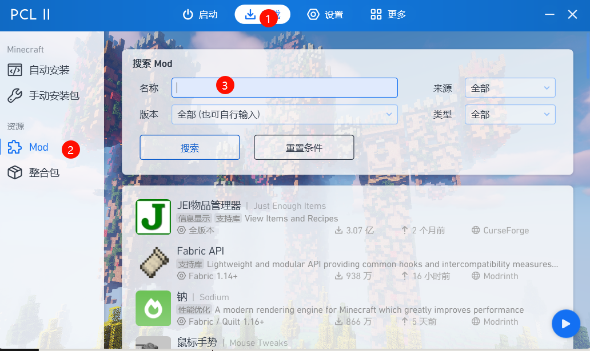

[TOC]

> 如果你不想折腾,只想有个人, 帮你咔咔一阵全部弄好,那就跳转到`远程协助操作`

# 下载安装Minecraft游戏本体

## 下载安装Java17*(必备)

1. 访问<https://www.oracle.com/java/technologies/javase/jdk17-archive-downloads.html>
2. 页面向下拉,找到`Windows x64 Installer`,点击后面的链接进行下载
   
3. 下载完成后运行程序安装

## 下载并配置PCL2

1. 搜索`PCL2`访问龙腾猫跃的爱发电主页, 或直接点击链接: <https://afdian.net/a/LTCat>
2. 点击左下角的免费的正式版下载链接
   
   
3. 复制链接到地址栏即可
   
4. 点进去下载, 不放图了, 应该都会
5. 将下载后的文件解压, 并将程序`Plain Craft Launcher 2.exe`**存放在单独的文件夹[^1]**,例如`D:/Games/PCL2`,这个文件夹将存放所有的关于Minecraft的文件
6. 双击运行`Plain Craft Launcher 2.exe`
7. 必要设置:
   - 在`设置`-`版本隔离`中选择`隔离所有版本`[^5]
     
   - 在`设置`-`游戏Java`中点击自动搜索,应当找到至少一个Java(即第一步安装的Java17)
     

8. 在`下载`页面选择版本`1.20.1`,在下面的`Fabric`中选择第一个,此时应自动将`Fabric API`选中了,点击`开始安装`[^2]
   
   
9. 回到`启动`页面,此时应自动选择了刚安装的版本,如果没有则点击`版本选择`自行选择
   

## 一些附加的东西(非必需)

### 推荐mod安装

在`下载`-`Mod`页面搜索并安装以下mod(**选择1.20.1版本带有`fabric`字样的版本,如有前置mod需一并安装**)

   *点击下面的链接可以查看mod详细介绍*

   - [Xaero的小地图](https://www.mcmod.cn/class/1701.html)`小地图`
   - [Xaero的世界地图](https://www.mcmod.cn/class/1483.html)`大地图`
   - [Carpet](https://www.mcmod.cn/class/2361.html)`功能很多,主要是能用假人`
   - [Tweakeroo](https://www.mcmod.cn/class/2230.html)`功能太多了,招牌功能灵魂出窍`
   - [MasaGadget](https://www.mcmod.cn/class/4203.html)`可以渲染村民补货时间,第一本附魔书等`
   - [Bobby](https://www.mcmod.cn/class/5291.html)`可以渲染服务器已经加载过的区块,变相增大视距`
   - [REI物品管理器](https://www.mcmod.cn/class/1674.html)`查看合成配方`
   - [玉](https://www.mcmod.cn/class/3482.html)`查看准心指的方块,实体等属性`
   - [万用皮肤补丁](https://www.mcmod.cn/class/883.html)`一个可以从网络或本地加载皮肤的模组`

### 光影与材质安装

>  待定  ~~有人需要我再写~~

### 如何购买正版

- **方法一**: 淘宝上找一个销量不错的商家代购,提供微软账号密码及验证码给客服代激活,由于商家的激活码一般是在阿根廷等低价区买到的,所以这种方法通常要比官网购买便宜
- **方法二**: 打开Windows自带的微软商店(*Microsoft Store*),搜索**Minecraft**即可购买

# 通过Radmin Lan加入我的服务器[^6]

**该内容已失效, 我们换了联机软件, 访问<http://www.luowb.cn/articles/natpierce/>**

1. ~~访问<https://www.radmin-lan.cn/>~~
2. ~~点击`免费下载`,等待下载完成~~
3. ~~打开安装程序并安装~~
4. ~~安装成功后,在`系统`-`防火墙例外`中将`允许所有应用`勾选~~
5. ~~`网络`中点击`加入网络`,网络名称为`Lo_server`密码为`114514`~~
6. ~~在Minecraft多人游戏中添加服务器,ip为`26.33.237.107`,等待片刻便可入服[^3]~~

# 远程协助操作

1. 访问<https://www.todesk.com/download.html>
2. 点击下载`精简版`
3. 打开下载的程序,告诉我你的设备代码与密码[^4]
4. 等待远程操作结束

# 疑难杂症

### 笔记本配置挺高, 但帧数不高, 尤其一开光影就掉帧怎么回事

**(建议所有笔记本玩家都改一下这个设置)**

那是因为Minecraft是在Java上运行的,而Windows默认给Java分配的核显,独显完全没工作,具体解决方法可参考视频:

[高配独显笔记本开光影却卡成PPT？一个小设置轻松提升帧率](https://www.bilibili.com/video/BV1nV411i7a7/)

# 脚注

[^1]:非常重要, 不一定是这个位置但最好放在单独的文件夹, 不然以后会散落一大堆别的文件
[^2]:如果你非要下载forge也可以,只是服务器的支持的一些mod只能用fabric,不安装将会失去一些体验,并不影响服务器游玩
[^3]:~~前提是我开服了才能进,我没有真正的服务器,我只是将服务端运行在电脑上,无法做到24小时在线.除非有富哥赞助我买个服务器~~ 现在我有真正的服务器辣! 只要学校不断电就能保持开启
[^4]: 可以在群内联系到我
[^5]: 这是为了防止不同版本mod冲突, 如果你知道各选项的含义可以自行选择
[^6]: 已失效
