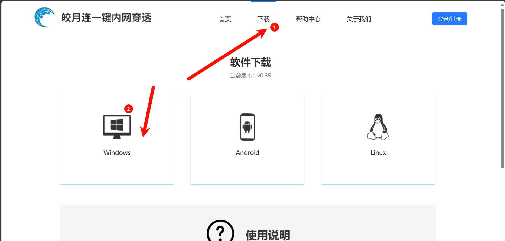
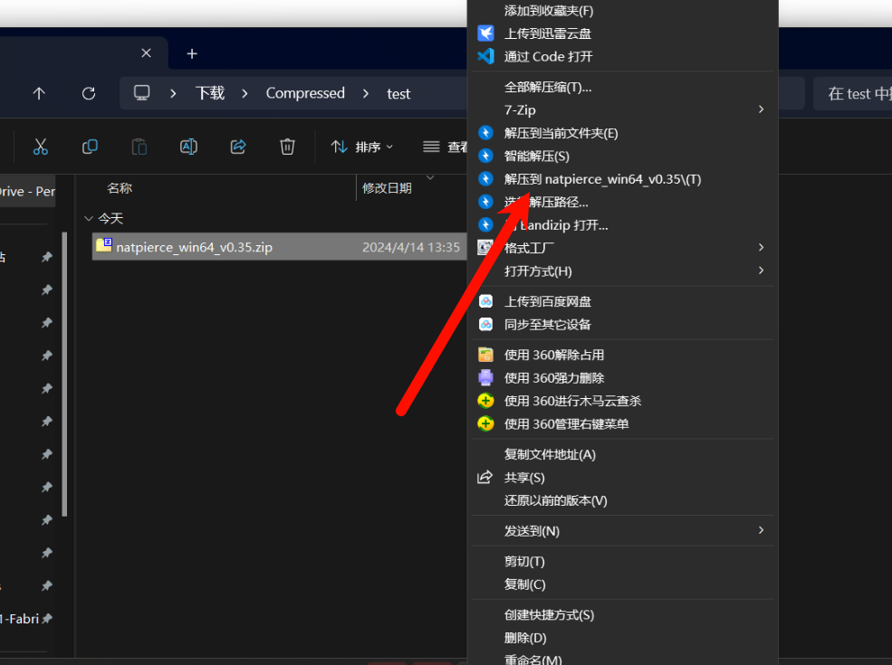
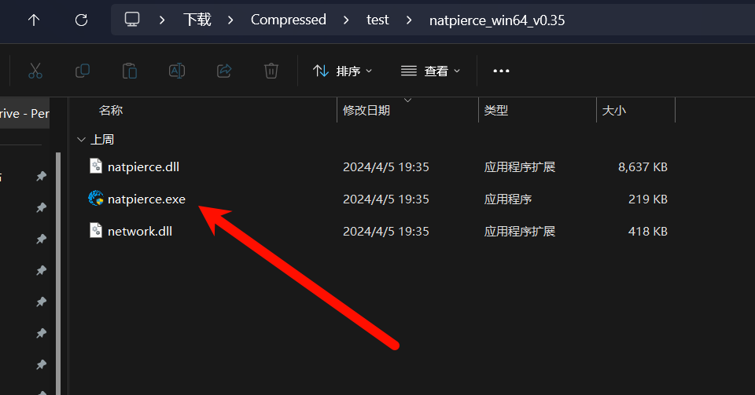
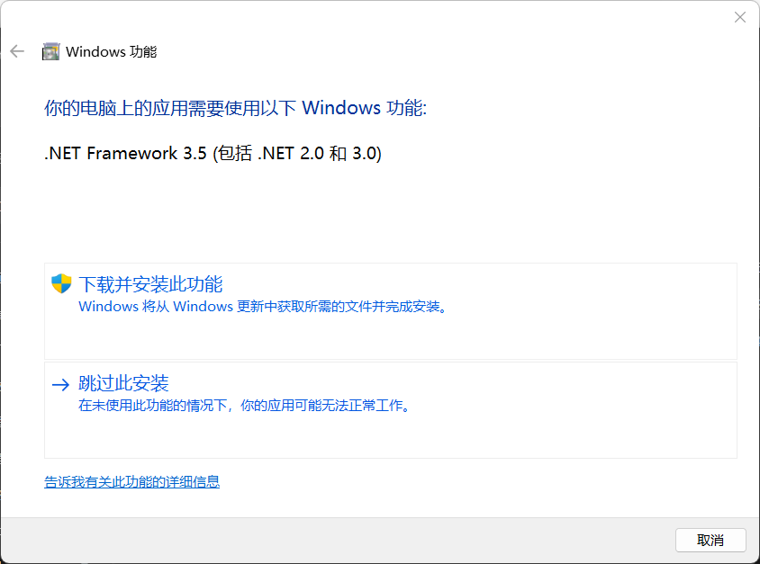
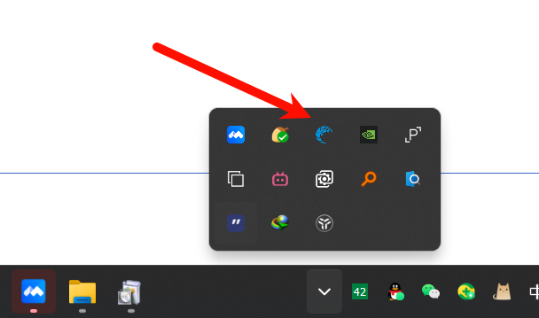
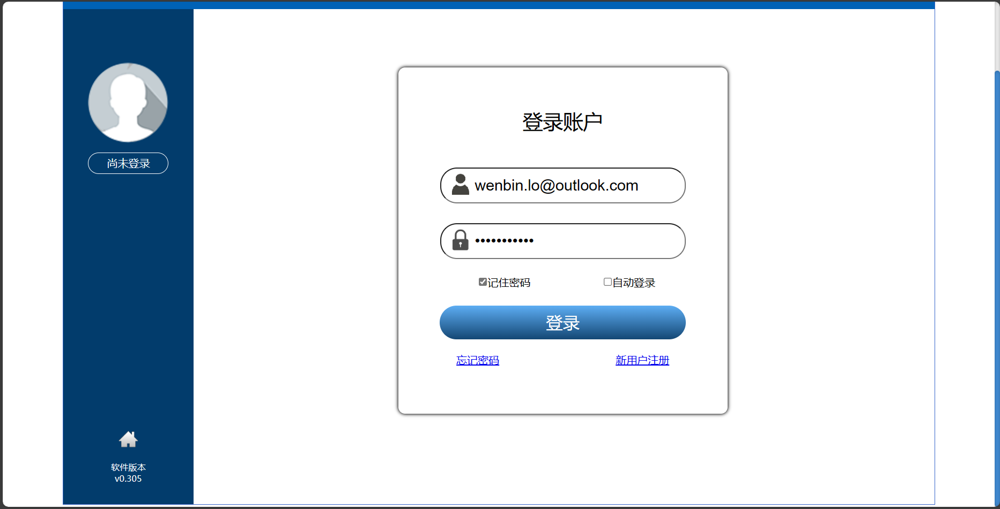
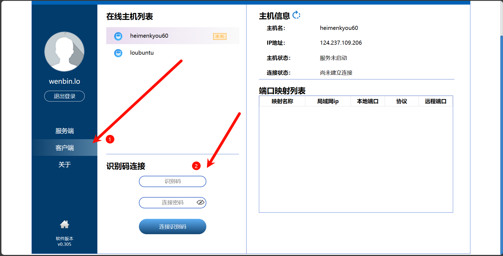
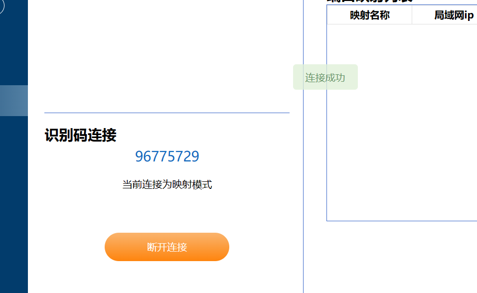
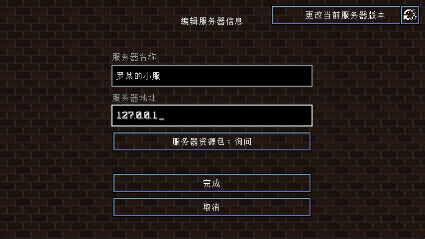

[TOC]

## 如何通过***皎月连***连接Minecraft服务器

### 1. 下载安装

1. 访问<https://www.natpierce.cn/>或在搜索引擎输入`皎月连`并访问其主页, 点击`下载`
   
   
2. 进入下载文件所在的文件夹, 解压下载到的压缩包
   
3. 进入解压后的文件夹, 双击运行`natpierce.exe`
   
4. 如果出现该提示, 可以点击`下载并安装此功能`, 如果安装不上也可以尝试`跳过此安装`
   

### 2. 使用

1. 双击运行后, 在右下角的任务栏会多出一个图标, 双击图标打开页面, 或者右键然后点击`显示主页面`
   
2. 按照提示注册并登录
   
3. 点击`客户端`, 输入连接码和密码以连接, 识别码: 96775729  密码: 114514(识别码可能会改变, 可以去QQ群中获取最新识别码)
   
4. 出现这个界面代表连接成功
   
5. 回到Minecraft游戏中, 在`多人游戏`界面添加服务器, 名称任意, `服务器地址`填入`127.0.0.1`
   
6. 玩罢!!