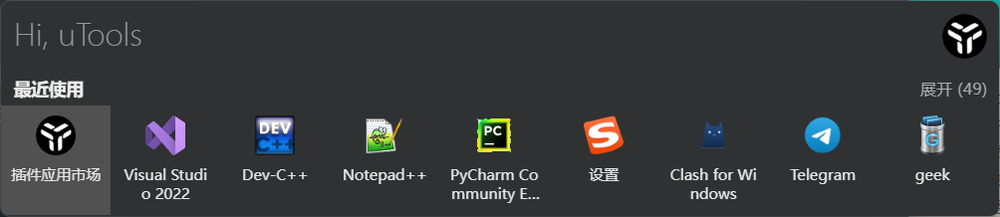
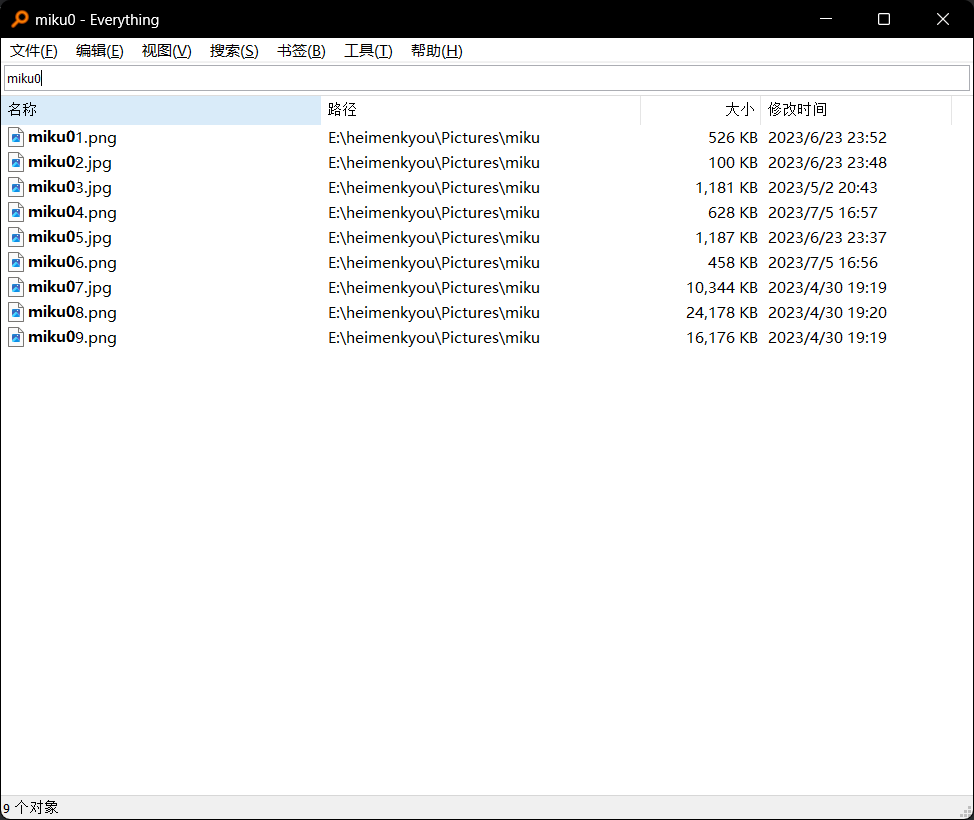
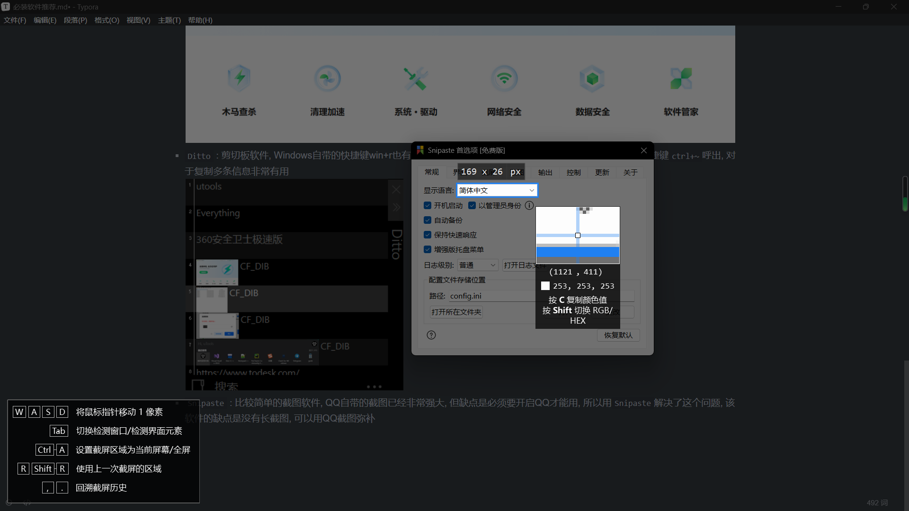

> 应杰桑[^1]邀约, 本人根据个人经验写下了这份清单, 以记录我自认为装机必备或是功能比较强大的软件, 本清单仅代表个人意见, 如果能帮助到正在看这份清单的人, 不幸荣幸.

## 装机必备

> 本清单推荐的所有软件都建议去官网下载, 在<https://www.bing.com>搜索可以大大减少广告出现的概率, 或者直接点击清单中软件的名字会自动跳转到官网

- [utools](https://u.tools/) : 快捷键`alr+空格`呼出, 键入文字以启动,同时也可以用它搜索文件, 有了此类启动软件后我便再没有在桌面放软件的快捷方式的习惯, 而相比其他的同类软件, `utools`还提供了大量非常实用的插件: 批量重命名,剪切板,OCR文字识别,快捷翻译等等.
   

   相似软件:

   - `wox`,功能类似, 但个人认为`utools`的插件市场更加丰富

-  [Everything](https://www.voidtools.com/zh-cn/) : 搜索文件神器, 建立好索引后搜索什么东西都是秒出结果, 比Windows资源管理器快了不知多少倍, 虽然`utools`软件也有文件搜索功能, 但`Everything`更加专业
   
   
-  [360安全卫士极速版](https://weishi.360.cn/jisu/) : 很多人说360是个流氓软件, 如果是指原版的360, 那确实, 但是如果在360官网留意一下并下载`极速版`, 那就是另一番体验, 极速版很纯净, 并没有广告, 里面的各种工具对于修复一些奇怪的错误非常有帮助.
   

-  [Ditto](https://ditto-cp.sourceforge.io/) : 剪切板软件, Windows自带的快捷键win+r也有这个功能, `utools`也有类似的插件, 但都不如Ditto方便, 快捷键`ctrl+~`呼出, 对于复制多条信息非常有用
   

-  [Snipaste](https://zh.snipaste.com/) : 比较简单的截图软件, QQ自带的截图已经非常强大, 但缺点是必须要开启QQ才能用, 所以用`Snipaste`解决了这个问题, 该软件的缺点是没有长截图, 可以用QQ截图弥补
   

-  [QuickLook](https://github.com/QL-Win/QuickLook/releases)[^2] : 选中文件后按空格预览, 对于快速查看多个文件内容时非常有用, 装上一些插件后, 能够快速预览PPT,word,PDF等文件而不打开它们, 速度非常快

-  [Internet Download Manager](https://www.internetdownloadmanager.com/) :下载神器, 下载速度相当快, 基本跑满带宽, 不过软件本身是付费的, 如需破解版请自行寻找
   

-  [Mem Reduct](https://www.henrypp.org/product/memreduct) : 可以出设置自动清理内存, 效果相当好
   ](./assets/Mem_Reduct.png)

-  未完待续……

[^1]: 通常情况下, 杰桑是指NPCTV主页上的某位特别鸣谢嘉宾()

[^2]: github网站在国内有时打不开或者下载速度慢, 可以去微软商店下载