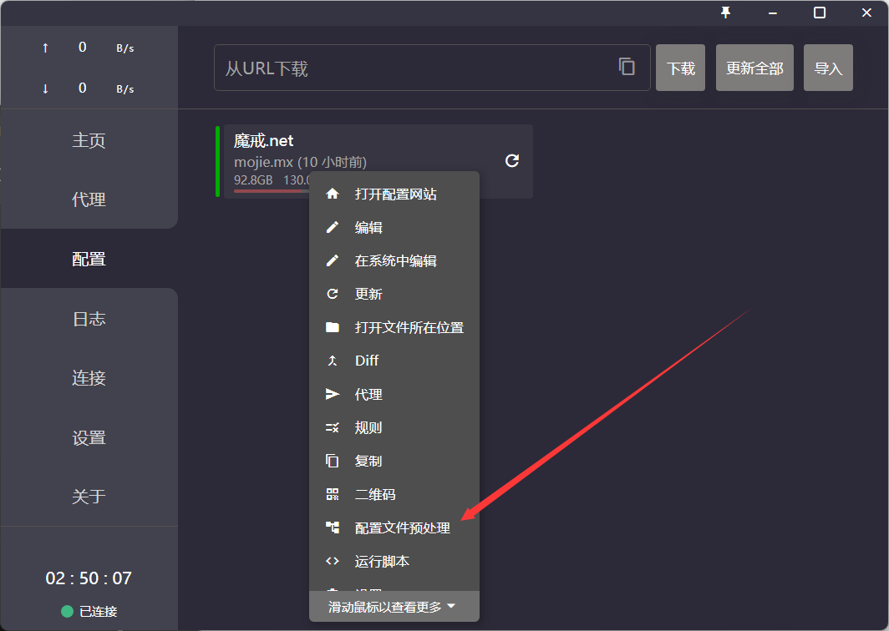
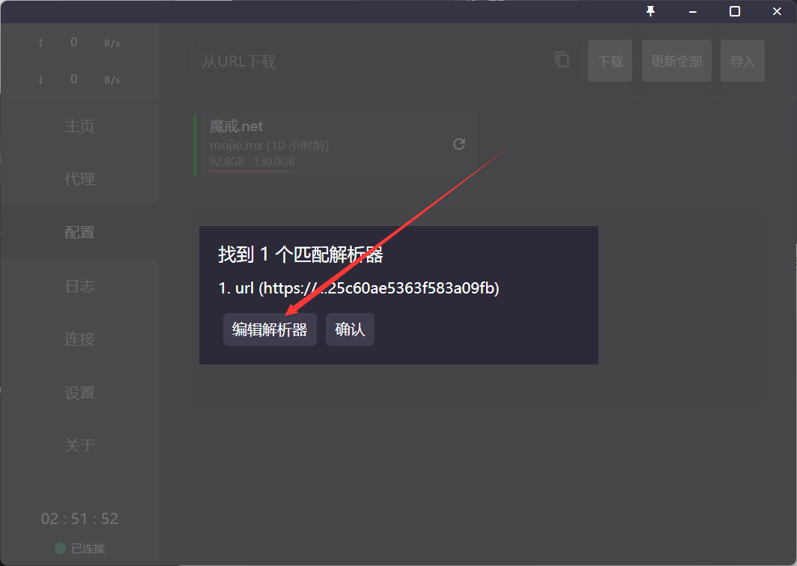
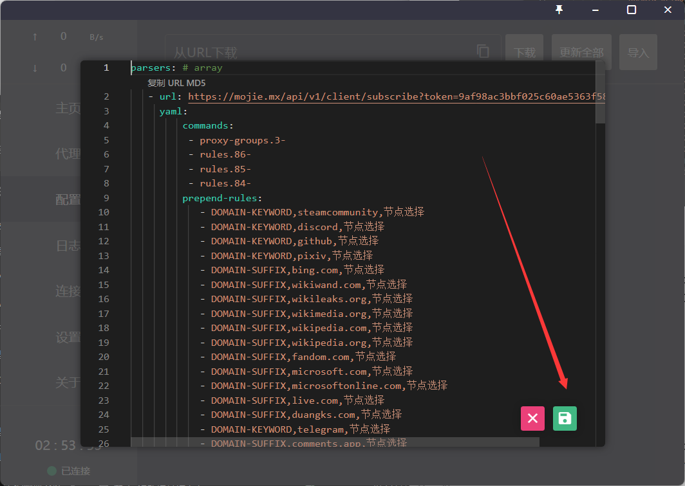
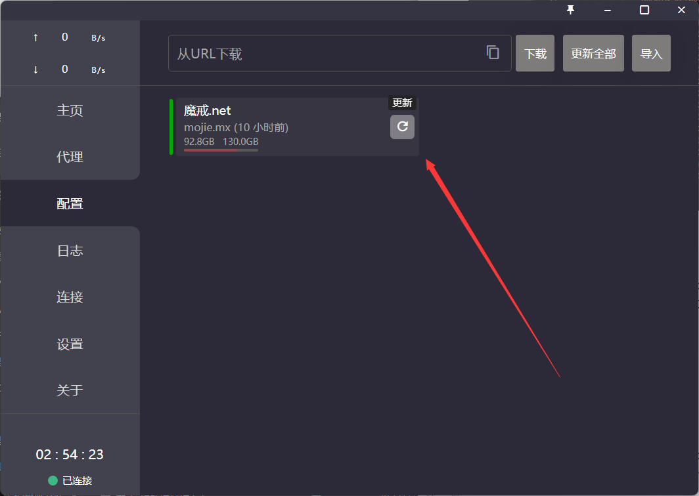

## 目录[^1]
- [English Version](#english-version)[^2]

- [点击跳转至中文教程](#中文版本)

---

## English Version

**How to Use Preprocessor in Clash for Windows**

1. Open Clash for Windows and right-click on the configuration you want to modify. Then, click on `parsers` or `配置文件预处理`.
   

2. Click on `Edit Parsers`or `编辑解析器`, delete all the existing content, and then copy and paste the content from the code block below. Finally, click on the Save button.
   
   

3. Click on the Update button.
   

```yaml
去另一个文件复制罢,懒得每次都更新这里
```

---

## 中文版本

**如何在clash for Windows中使用预处理文件**

1. 打开clash,右键选中需要修改的配置并点击`parsers`或`配置文件预处理`
   
2. 点击`编辑解析器`删除里面所有的内容,并将下面代码框中的内容复制粘贴进去,然后点保存按钮
   
   
3. 点击更新按钮
   

```yaml
去另一个文件复制罢,懒得每次都更新这里
```

---
## 彩蛋

这是 :older_man:第一次使用markdown的第一次示例,:older_man:用了不少功夫整这~~寄吧~~东西(~~尤其是寄吧图片和目录~~)
> 2023-7-30 01:20:34
---
## 脚注释义
[^1]::older_man:整了半天的目录发现坚果云左侧自带!~~焯!:anger:~~
[^2]: ~~标题有空格的在坚果云中并不能正常工作,也就是无法跳转~~ **我已经搞明白了,问题已解决!**
