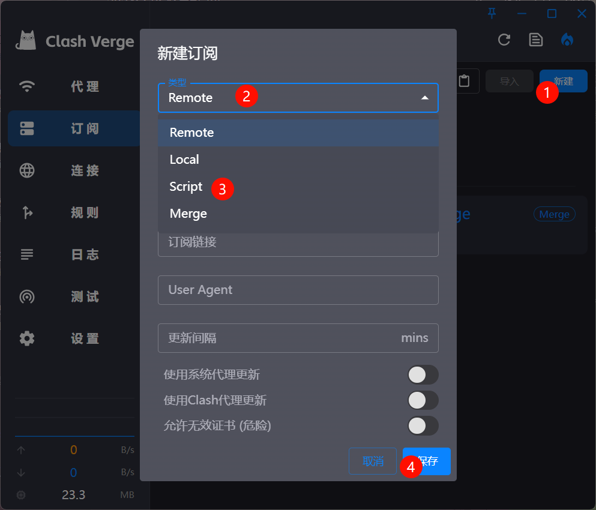
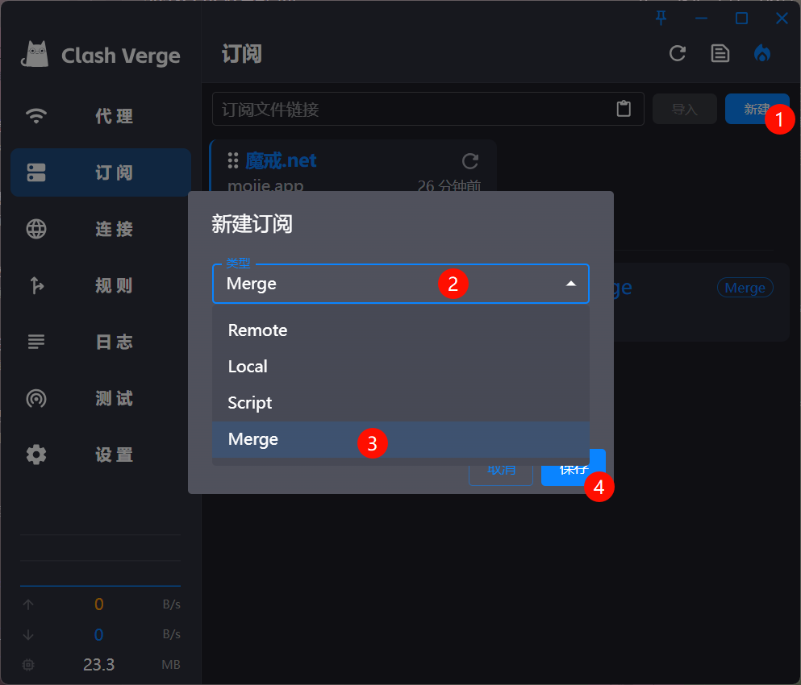
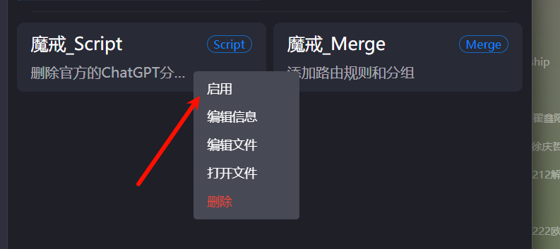
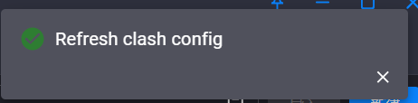

1. `订阅`-右上角`新建`, 先后创建``Scipt`和`Merge`, 名称和描述任意
     
     
2. 先右键`启用`这两个订阅, 注意要先启用再进行下一步粘贴, 不然可能会卡主无法启动(可能是因为配置太长了(恼))
     
3. 右键编辑文件, 分别复制`魔戒_Script`和`魔戒_Merge`文件中的配置, 并粘贴到对应文件中, 最后点击右上角
     
4. 如果出现这样的提示说明合并成功, 如果报错, 请检查Script是否在Merge前面
     