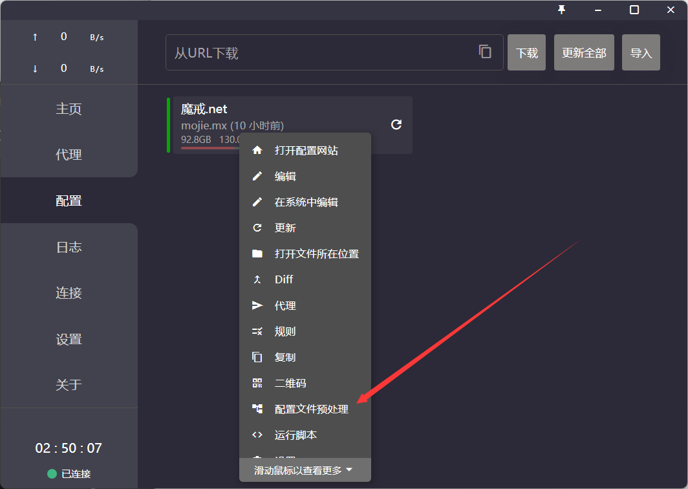
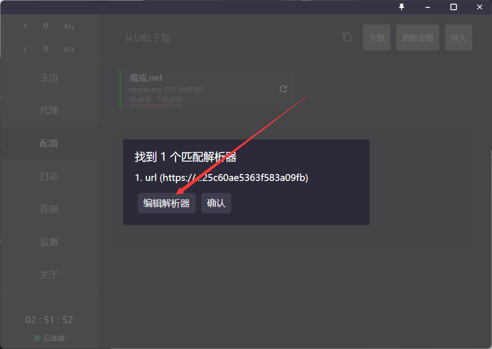
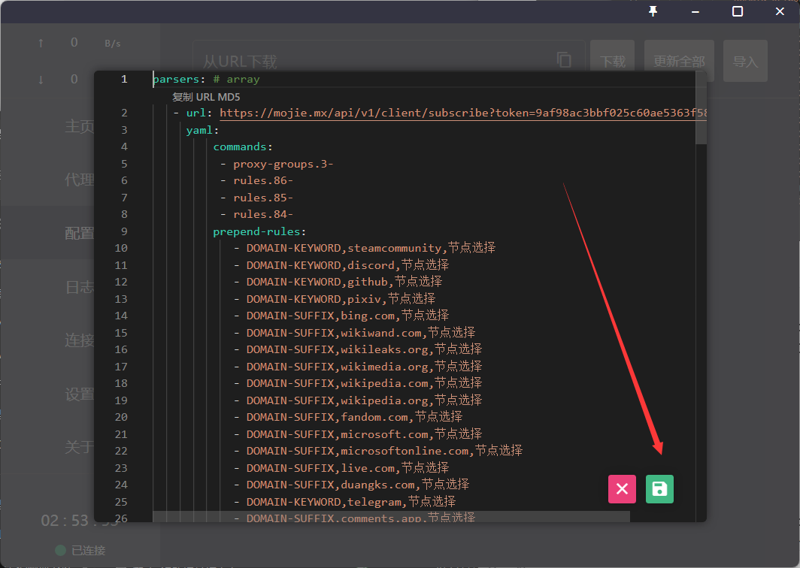
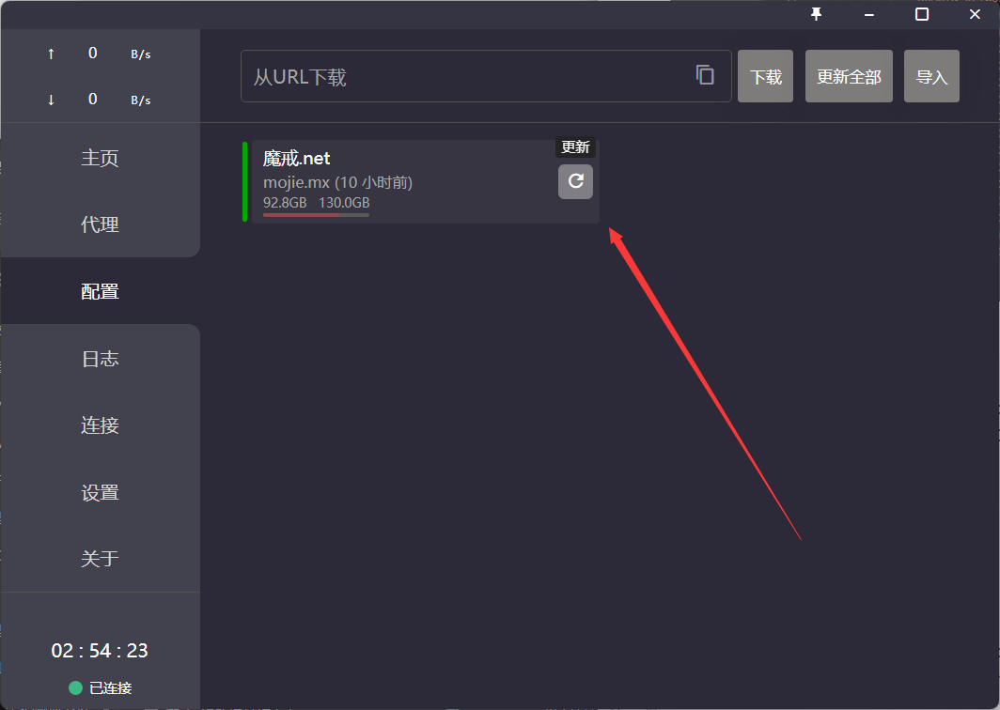

## 目录[^1]
- [English Version](#english-version)[^2]

- [点击跳转至中文教程](#中文版本)

---

## English Version

**How to Use Preprocessor in Clash for Windows**

1. Open Clash for Windows and right-click on the configuration you want to modify. Then, click on `parsers` or `配置文件预处理`.
   

2. Click on `Edit Parsers`or `编辑解析器`, delete all the existing content, and then copy and paste the content from the code block below. Finally, click on the Save button.
   
   

3. Click on the Update button.
   

```yaml
parsers: # array
   - url: https://mojie.mom/api/v1/client/subscribe?token=c623fcbba5b35262ca0deefcea4265cb
     yaml: 
         commands:
          - proxy-groups.3-
          - rules.89-
          - rules.88-
          - rules.87-
         prepend-rules:
            - DOMAIN-KEYWORD,discord,节点选择
            - DOMAIN-KEYWORD,github,节点选择
            - DOMAIN-KEYWORD,pixiv,节点选择
            - DOMAIN-SUFFIX,pximg.net,节点选择
            - DOMAIN-SUFFIX,bing.com,节点选择
            - DOMAIN-SUFFIX,youtu.be,谷歌服务
            - DOMAIN-KEYWORD,youtube,谷歌服务
            - DOMAIN-SUFFIX,wikiwand.com,节点选择
            - DOMAIN-SUFFIX,wikileaks.org,节点选择
            - DOMAIN-SUFFIX,wikimedia.org,节点选择
            - DOMAIN-SUFFIX,wikipedia.com,节点选择
            - DOMAIN-SUFFIX,wikipedia.org,节点选择
            - DOMAIN-SUFFIX,fandom.com,节点选择
            - DOMAIN-SUFFIX,microsoft.com,节点选择
            - DOMAIN-SUFFIX,microsoftonline.com,节点选择
            - DOMAIN-SUFFIX,live.com,节点选择
            - DOMAIN-SUFFIX,duangks.com,节点选择
            - DOMAIN-KEYWORD,telegram,节点选择
            - DOMAIN-SUFFIX,comments.app,节点选择
            - DOMAIN-SUFFIX,graph.org,节点选择
            - DOMAIN-SUFFIX,stel.com,节点选择
            - DOMAIN-SUFFIX,t.me,节点选择
            - DOMAIN-SUFFIX,tdesktop.com,节点选择
            - DOMAIN-SUFFIX,telega.one,节点选择
            - DOMAIN-SUFFIX,telegra.ph,节点选择
            - DOMAIN-SUFFIX,telegram.dog,节点选择
            - DOMAIN-SUFFIX,telegram.me,节点选择
            - DOMAIN-SUFFIX,telegram.org,节点选择
            - DOMAIN-SUFFIX,telegram.space,节点选择
            - DOMAIN-SUFFIX,telegramdownload.com,节点选择
            - DOMAIN-SUFFIX,telesco.pe,节点选择
            - DOMAIN-SUFFIX,tg.dev,节点选择
            - DOMAIN-SUFFIX,tx.me,节点选择
            - DOMAIN-KEYWORD,nicegram,节点选择
            - DOMAIN-KEYWORD,telegram,节点选择
            - IP-CIDR,109.239.140.0/24,节点选择,no-resolve
            - IP-CIDR,149.154.160.0/20,节点选择,no-resolve
            - IP-CIDR,185.76.151.0/24,节点选择,no-resolve
            - IP-CIDR,91.105.192.0/23,节点选择,no-resolve
            - IP-CIDR,91.108.0.0/16,节点选择,no-resolve
            - IP-CIDR,95.161.64.0/20,节点选择,no-resolve
            - IP-CIDR6,2001:67c:4e8::/48,节点选择,no-resolve
            - IP-CIDR6,2001:b28:f23c::/47,节点选择,no-resolve
            - IP-CIDR6,2001:b28:f23f::/48,节点选择,no-resolve
            - IP-CIDR6,2a0a:f280::/32,节点选择,no-resolve
            - PROCESS-NAME,nekox.messenger,节点选择
            - PROCESS-NAME,org.telegram.messenger,节点选择
            - PROCESS-NAME,telegram.exe,节点选择
            - PROCESS-NAME,org.telegram.messenger,节点选择
            - DOMAIN-KEYWORD,openai,🤖 ChatGPT
            - MATCH,节点选择
         append-proxy-groups:
           - name: 🤖 ChatGPT
             type: select
             proxies:
              - 🤖 ChatGPT（Auto）
              - 节点选择
              - 美国USLA-T  (ChatGPT)
              - 美国LA-优化 (ChatGPT)
              - 美国LA-优化2 (ChatGPT)
              - 美国LA-优化3  (ChatGPT)
              - 日本JP-T
              - 柬埔寨KH-T
              - 台湾HINET-T
              - 以色列IL-T
              - 哈萨克斯坦KZ-T
              - 英国UK-T
              - 波兰PL-T
              - 葡萄牙PT-T
              - 俄罗斯RU-T
              - 乌克兰UA-T
              - 土耳其TR-T
              - 阿根廷AR-T
              - 日本-优化
              - 日本-优化2
              - 日本-优化3
              - 印度-优化
              - 台湾-优化
              - 台湾-优化2
              - 台湾-优化3
              - 英国-优化
              - 英国-优化2
              - 英国-优化3
              
           - name: 🤖 ChatGPT（Auto）
             type: url-test
             proxies:
              - 美国USLA-T  (ChatGPT)
              - 美国LA-优化 (ChatGPT)
              - 美国LA-优化2 (ChatGPT)
              - 美国LA-优化3  (ChatGPT)
              - 日本JP-T
              - 柬埔寨KH-T
              - 台湾HINET-T
              - 以色列IL-T
              - 哈萨克斯坦KZ-T
              - 英国UK-T
              - 波兰PL-T
              - 葡萄牙PT-T
              - 俄罗斯RU-T
              - 乌克兰UA-T
              - 土耳其TR-T
              - 阿根廷AR-T
              - 日本-优化
              - 日本-优化2
              - 日本-优化3
              - 印度-优化
              - 台湾-优化
              - 台湾-优化2
              - 台湾-优化3
              - 英国-优化
              - 英国-优化2
              - 英国-优化3
             url: http://www.chat.openai.com
             interval: 300
             tolerance: 7200

           - name: 🐟 漏网之鱼
             type: select
             proxies:
              - DIRECT
              - 自动选择
              - 中转节点
              - 直连节点
              - 故障转移
              - 套餐到期：长期有效
              - 日本JP-T
              - 新加坡SG-T
              - 香港HKT-T
              - 柬埔寨KH-T
              - 越南VN-T
              - 台湾HINET-T
              - 香港wap-T
              - 韩国KR-T
              - 以色列IL-T
              - 哈萨克斯坦KZ-T
              - 美国USLA-T  (ChatGPT)
              - 英国UK-T
              - 波兰PL-T
              - 瑞士CH-T
              - 葡萄牙PT-T
              - 卢森堡LUX-T
              - 澳大利亚AU-T
              - 俄罗斯RU-T
              - 乌克兰UA-T
              - 土耳其TR-T
              - 阿根廷AR-T
              - 尼日利亚NI-T
              - 日本-优化
              - 日本-优化2
              - 日本-优化3
              - 新加坡-优化
              - 新加坡-优化2
              - 新加坡-优化3
              - 香港WAP-优化
              - 香港WAP-优化2
              - 香港HKT-优化
              - 香港HKT-优化2
              - 香港HKT-优化3
              - 印度-优化
              - 台湾-优化
              - 台湾-优化2
              - 台湾-优化3
              - 美国LA-优化 (ChatGPT)
              - 美国LA-优化2 (ChatGPT)
              - 美国LA-优化3  (ChatGPT)
              - 英国-优化
              - 英国-优化2
              - 英国-优化3
```

---

## 中文版本

**如何在clash for Windows中使用预处理文件**

1. 打开clash,右键选中需要修改的配置并点击`parsers`或`配置文件预处理`
   
2. 点击`编辑解析器`删除里面所有的内容,并将下面代码框中的内容复制粘贴进去,然后点保存按钮
   
   
3. 点击更新按钮
   

```yaml
parsers: # array
   - url: https://mojie.mom/api/v1/client/subscribe?token=c623fcbba5b35262ca0deefcea4265cb
     yaml: 
         commands:
          - proxy-groups.3-
          - rules.89-
          - rules.88-
          - rules.87-
         prepend-rules:
            - DOMAIN-KEYWORD,discord,节点选择
            - DOMAIN-KEYWORD,github,节点选择
            - DOMAIN-KEYWORD,pixiv,节点选择
            - DOMAIN-SUFFIX,pximg.net,节点选择
            - DOMAIN-SUFFIX,bing.com,节点选择
            - DOMAIN-SUFFIX,youtu.be,谷歌服务
            - DOMAIN-KEYWORD,youtube,谷歌服务
            - DOMAIN-SUFFIX,wikiwand.com,节点选择
            - DOMAIN-SUFFIX,wikileaks.org,节点选择
            - DOMAIN-SUFFIX,wikimedia.org,节点选择
            - DOMAIN-SUFFIX,wikipedia.com,节点选择
            - DOMAIN-SUFFIX,wikipedia.org,节点选择
            - DOMAIN-SUFFIX,fandom.com,节点选择
            - DOMAIN-SUFFIX,microsoft.com,节点选择
            - DOMAIN-SUFFIX,microsoftonline.com,节点选择
            - DOMAIN-SUFFIX,live.com,节点选择
            - DOMAIN-SUFFIX,duangks.com,节点选择
            - DOMAIN-KEYWORD,telegram,节点选择
            - DOMAIN-SUFFIX,comments.app,节点选择
            - DOMAIN-SUFFIX,graph.org,节点选择
            - DOMAIN-SUFFIX,stel.com,节点选择
            - DOMAIN-SUFFIX,t.me,节点选择
            - DOMAIN-SUFFIX,tdesktop.com,节点选择
            - DOMAIN-SUFFIX,telega.one,节点选择
            - DOMAIN-SUFFIX,telegra.ph,节点选择
            - DOMAIN-SUFFIX,telegram.dog,节点选择
            - DOMAIN-SUFFIX,telegram.me,节点选择
            - DOMAIN-SUFFIX,telegram.org,节点选择
            - DOMAIN-SUFFIX,telegram.space,节点选择
            - DOMAIN-SUFFIX,telegramdownload.com,节点选择
            - DOMAIN-SUFFIX,telesco.pe,节点选择
            - DOMAIN-SUFFIX,tg.dev,节点选择
            - DOMAIN-SUFFIX,tx.me,节点选择
            - DOMAIN-KEYWORD,nicegram,节点选择
            - DOMAIN-KEYWORD,telegram,节点选择
            - IP-CIDR,109.239.140.0/24,节点选择,no-resolve
            - IP-CIDR,149.154.160.0/20,节点选择,no-resolve
            - IP-CIDR,185.76.151.0/24,节点选择,no-resolve
            - IP-CIDR,91.105.192.0/23,节点选择,no-resolve
            - IP-CIDR,91.108.0.0/16,节点选择,no-resolve
            - IP-CIDR,95.161.64.0/20,节点选择,no-resolve
            - IP-CIDR6,2001:67c:4e8::/48,节点选择,no-resolve
            - IP-CIDR6,2001:b28:f23c::/47,节点选择,no-resolve
            - IP-CIDR6,2001:b28:f23f::/48,节点选择,no-resolve
            - IP-CIDR6,2a0a:f280::/32,节点选择,no-resolve
            - PROCESS-NAME,nekox.messenger,节点选择
            - PROCESS-NAME,org.telegram.messenger,节点选择
            - PROCESS-NAME,telegram.exe,节点选择
            - PROCESS-NAME,org.telegram.messenger,节点选择
            - DOMAIN-KEYWORD,openai,🤖 ChatGPT
            - MATCH,节点选择
         append-proxy-groups:
           - name: 🤖 ChatGPT
             type: select
             proxies:
              - 🤖 ChatGPT（Auto）
              - 节点选择
              - 美国USLA-T  (ChatGPT)
              - 美国LA-优化 (ChatGPT)
              - 美国LA-优化2 (ChatGPT)
              - 美国LA-优化3  (ChatGPT)
              - 日本JP-T
              - 柬埔寨KH-T
              - 台湾HINET-T
              - 以色列IL-T
              - 哈萨克斯坦KZ-T
              - 英国UK-T
              - 波兰PL-T
              - 葡萄牙PT-T
              - 俄罗斯RU-T
              - 乌克兰UA-T
              - 土耳其TR-T
              - 阿根廷AR-T
              - 日本-优化
              - 日本-优化2
              - 日本-优化3
              - 印度-优化
              - 台湾-优化
              - 台湾-优化2
              - 台湾-优化3
              - 英国-优化
              - 英国-优化2
              - 英国-优化3
              
           - name: 🤖 ChatGPT（Auto）
             type: url-test
             proxies:
              - 美国USLA-T  (ChatGPT)
              - 美国LA-优化 (ChatGPT)
              - 美国LA-优化2 (ChatGPT)
              - 美国LA-优化3  (ChatGPT)
              - 日本JP-T
              - 柬埔寨KH-T
              - 台湾HINET-T
              - 以色列IL-T
              - 哈萨克斯坦KZ-T
              - 英国UK-T
              - 波兰PL-T
              - 葡萄牙PT-T
              - 俄罗斯RU-T
              - 乌克兰UA-T
              - 土耳其TR-T
              - 阿根廷AR-T
              - 日本-优化
              - 日本-优化2
              - 日本-优化3
              - 印度-优化
              - 台湾-优化
              - 台湾-优化2
              - 台湾-优化3
              - 英国-优化
              - 英国-优化2
              - 英国-优化3
             url: http://www.chat.openai.com
             interval: 300
             tolerance: 7200

           - name: 🐟 漏网之鱼
             type: select
             proxies:
              - DIRECT
              - 自动选择
              - 中转节点
              - 直连节点
              - 故障转移
              - 套餐到期：长期有效
              - 日本JP-T
              - 新加坡SG-T
              - 香港HKT-T
              - 柬埔寨KH-T
              - 越南VN-T
              - 台湾HINET-T
              - 香港wap-T
              - 韩国KR-T
              - 以色列IL-T
              - 哈萨克斯坦KZ-T
              - 美国USLA-T  (ChatGPT)
              - 英国UK-T
              - 波兰PL-T
              - 瑞士CH-T
              - 葡萄牙PT-T
              - 卢森堡LUX-T
              - 澳大利亚AU-T
              - 俄罗斯RU-T
              - 乌克兰UA-T
              - 土耳其TR-T
              - 阿根廷AR-T
              - 尼日利亚NI-T
              - 日本-优化
              - 日本-优化2
              - 日本-优化3
              - 新加坡-优化
              - 新加坡-优化2
              - 新加坡-优化3
              - 香港WAP-优化
              - 香港WAP-优化2
              - 香港HKT-优化
              - 香港HKT-优化2
              - 香港HKT-优化3
              - 印度-优化
              - 台湾-优化
              - 台湾-优化2
              - 台湾-优化3
              - 美国LA-优化 (ChatGPT)
              - 美国LA-优化2 (ChatGPT)
              - 美国LA-优化3  (ChatGPT)
              - 英国-优化
              - 英国-优化2
              - 英国-优化3
```

---
## 彩蛋

这是 :older_man:第一次使用markdown的第一次示例,:older_man:用了不少功夫整这~~寄吧~~东西(~~尤其是寄吧图片和目录~~)
> 2023-7-30 01:20:34
---
## 脚注释义
[^1]::older_man:整了半天的目录发现坚果云左侧自带!~~焯!:anger:~~
[^2]: ~~标题有空格的在坚果云中并不能正常工作,也就是无法跳转~~ **我已经搞明白了,问题已解决!**